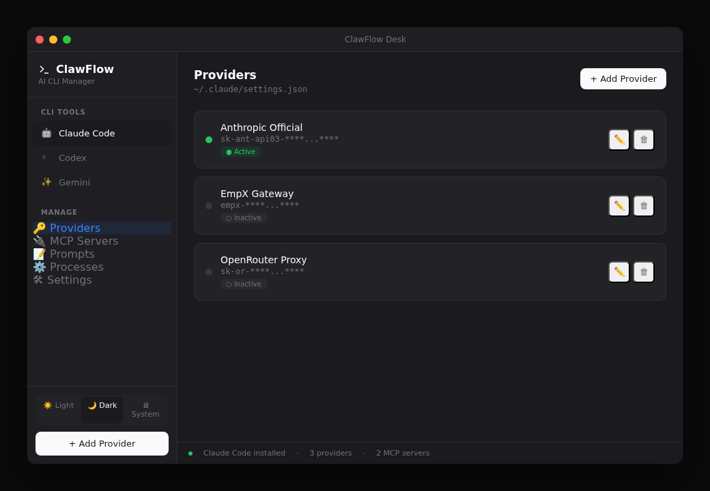

<div align="center">

# ⚡ ClawFlow Desk

**Ultra-lightweight AI CLI configuration manager**



Manage Claude Code / Codex / Gemini CLI providers, models, and configs from one place.

Built with [Electrobun](https://electrobun.dev) — 14MB bundle, <50ms startup.

[](LICENSE)

</div>

---

## Features

- **Provider Management** — One-click switching between API providers for Claude Code, Codex, and Gemini CLI
- **Model Configuration** — Visual editor for model parameters
- **System Tray** — Quick-switch providers without opening the main window
- **Atomic Writes** — Safe config file updates with rollback protection
- **SQLite Storage** — Local database for provider configs
- **Dark/Light Theme** — Automatic theme detection

## Supported CLIs

| CLI | Config Files | Status |
|-----|-------------|--------|
| Claude Code | `~/.claude/settings.json`, `~/.claude.json` | ✅ |
| Codex | `~/.codex/auth.json`, `~/.codex/config.toml` | ✅ |
| Gemini CLI | `~/.gemini/.env`, `~/.gemini/settings.json` | ✅ |

## Development

### Prerequisites

- [Bun](https://bun.sh) 1.x+
- macOS / Windows / Linux

### Setup

```bash
git clone https://github.com/openclaw-infra/clawflow-desk.git
cd clawflow-desk
bun install
```

### Dev Mode

```bash
# Without HMR
bun run start

# With HMR (recommended)
bun run dev:hmr
```

### Build

```bash
bun run build:canary
```

## Architecture

```
clawflow-desk/
├── src/
│   ├── bun/                  # Backend (Bun process)
│   │   ├── index.ts          # Entry + window + IPC handlers
│   │   └── config/
│   │       ├── types.ts      # Type definitions
│   │       ├── manager.ts    # Unified config manager (SQLite)
│   │       ├── claude.ts     # Claude Code config adapter
│   │       ├── codex.ts      # Codex config adapter
│   │       └── gemini.ts     # Gemini config adapter
│   └── mainview/             # Frontend (React + Tailwind)
│       ├── App.tsx           # Main app
│       ├── types.ts          # Shared types
│       └── components/
│           ├── Sidebar.tsx
│           ├── ProviderList.tsx
│           ├── ProviderForm.tsx
│           └── StatusBar.tsx
├── electrobun.config.ts      # Electrobun build config
├── vite.config.ts            # Vite config
└── package.json
```

## Roadmap

- [x] Phase 1: Provider management + model config
- [ ] Phase 2: MCP server management + Prompts management
- [ ] Phase 3: CLI process management + embedded terminal

## License

MIT © [openclaw-infra](https://github.com/openclaw-infra)
